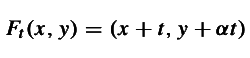
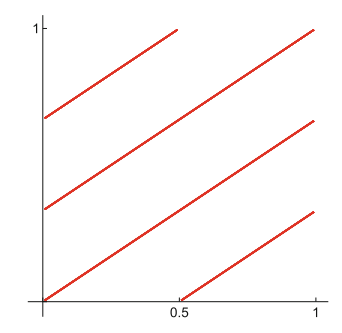
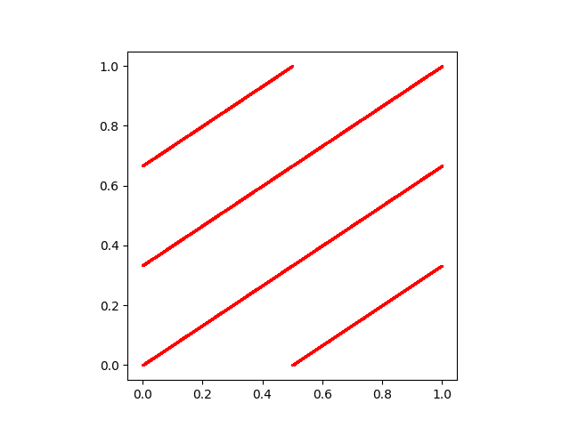
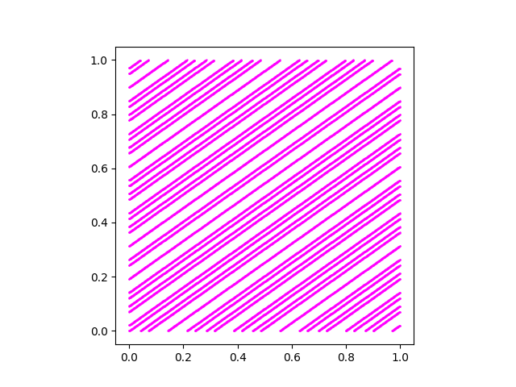

# DYNSYS-E1: Dynamic Systems | Flow in a bidimensional Torus.

## Affiliation

A project by Alexis Hassiel Nuviedo Arriaga ([@nuviedo](https://github.com/nuviedo)) ([alexis.nuviedo@gmail.com](mailto:alexis.nuviedo@gmail.com)), as part of the first partial exam of the Dynamic Systems 2022-2 class imparted at the [*Escuela Nacional de Estudios Superiores*, campus Morelia](https://www.enesmorelia.unam.mx/), [UNAM](https://www.unam.mx/), by Dr. (Victor de la Luz)[https://github.com/itztli].

## Problem description

The problem resides in replicating the flow in a bidimensional torus T2=R2/Z2 given by the following equation:

With the aim of replicating the following resultant image:

By making use of the following parameters:
* (x,y) = (0,0)
* t = [0,30] in R
* a = 2/5

During experimentation, it was discovered that the parameter *a* must instead be 2/3, as 2/5 provides the wrong result. The model was examined under different conditions mentioned in the reference, such as a=1/SQRT(2), and provided adequate results.

The following is the resulting image generated by the solution, [Sol.py](Sol.py)

As a compliment, here is the resulting image of using a=1/SQRT(2).

## Requirements
* [Numpy](https://numpy.org/)

## Steps to reproduce

* Execute [Sol.py](Sol.py).
* Extract resulting .png from current working directory.

## References
Hawkins, J. (2021). Ergodic Dynamics: From Basic Theory to Applications (2021 ed.). p. 2 Springer.

